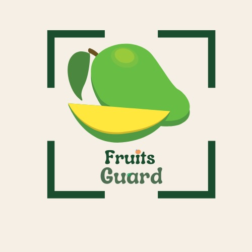
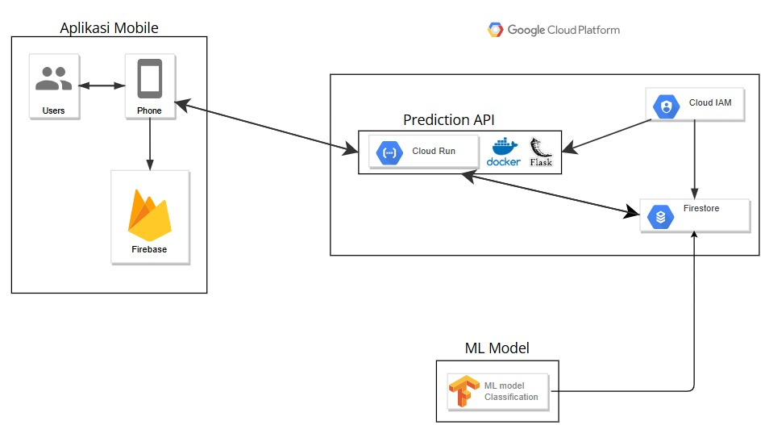

<p align="center">
  
</p>

<h1 align="center">FruitGuard</h1>
Fruit Guard is an innovative web application that allows users to predict the condition of fruits by uploading images of the fruit. Currently, the application is still in development, but the initial features that are available include:

1. Predicting fruit conditions.

To access this service, you need to log in using a username and password. If you do not have an account, you can register through the registration feature. It is important to remember not to spam the registration service to maintain the performance of the application.

Available services:
Prediction
```sh
POST /prediction/Strawberry
POST /prediction/Banana
POST /prediction/Guava
POST /prediction/Orange
POST /prediction/Mango
POST /prediction/Apple
POST /prediction/Grape
```

# Overview
### Architecture


# Instructions
### Prediction Service
The prediction service uses imgUr.
For imgUrl, this is the url of a publicly accessible image. The image must be in an image format such as (jpg, png, jpeg)
If the prediction is successful, you will get a json object. The json object contains the prediction result. The prediction result contains the highest probability and the predicted class, with some additional information related to the class.
> Documentation: [Postman Documenter](https://documenter.getpostman.com/view/40228210/2sAYBbcTeM)

## **CC Path:**

| Name | Student ID | University |
| -------------------- | ------------ | ---------------- |
| Afif Far Hani | C308B4kY0150 | University of Riau |
| Diaz Firman Syam | C308B4kY1118 | University of Riau |

## **Requirements & Tools:**


#
